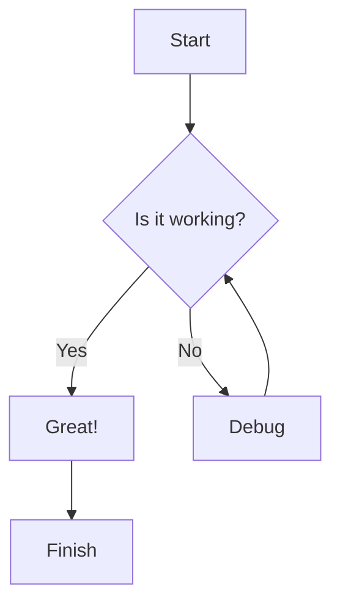
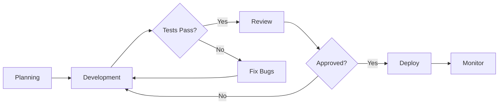
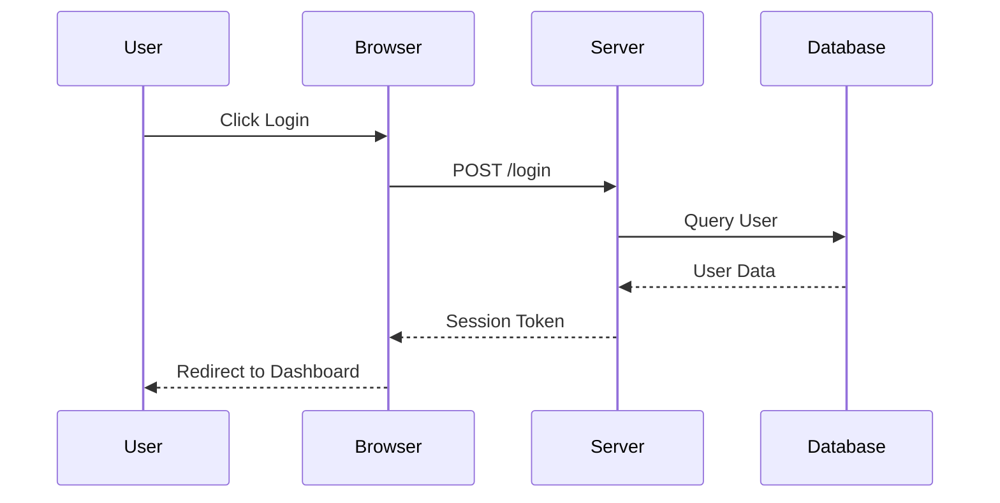
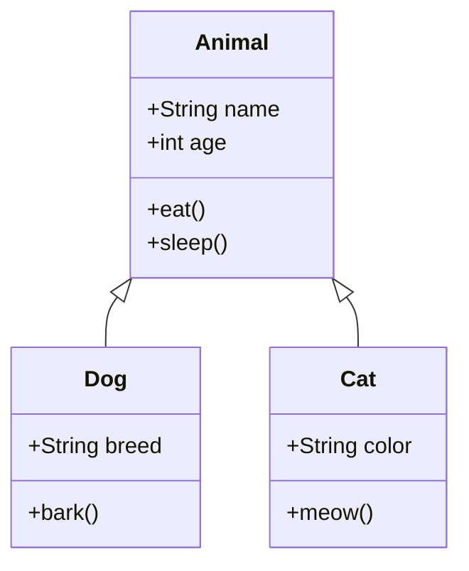
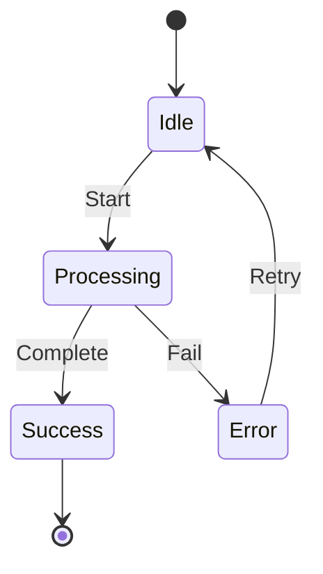
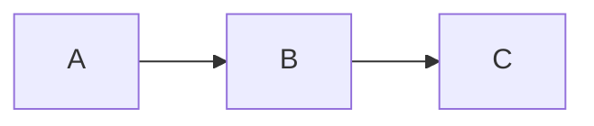

This post demonstrates how to use Mermaid.js to create beautiful diagrams directly in your Markdown content. Mermaid allows you to write diagram definitions as code blocks that are automatically rendered as visual diagrams.

## Flowcharts

Flowcharts are perfect for showing step-by-step processes or decision trees.



Here's a more complex flowchart showing a software development process:



## Sequence Diagrams

Sequence diagrams show how different components or actors interact with each other over time.



## Class Diagrams

Class diagrams are useful for showing the structure and relationships in object-oriented code.



## State Diagrams

State diagrams show the different states an object can be in and how it transitions between them.



## Getting Started

To use Mermaid diagrams in your posts:

1. Create a code block with the `mermaid` language identifier
2. Write your diagram definition inside the block
3. Jekyll will render it automatically when the page loads

### Example Syntax

```markdown

```

## Tips

- Use `TD` for top-down flowcharts and `LR` for left-right
- Add labels to arrows using `-->|label|` syntax
- Use descriptive names for nodes and states
- Test your diagrams in the [Mermaid Live Editor](https://mermaid.live/)

## Resources

- [Mermaid Official Documentation](https://mermaid.js.org/intro/)
- [Mermaid Live Editor](https://mermaid.live/)
- [Mermaid Syntax Guide](https://mermaid.js.org/syntax/flowchart.html)
