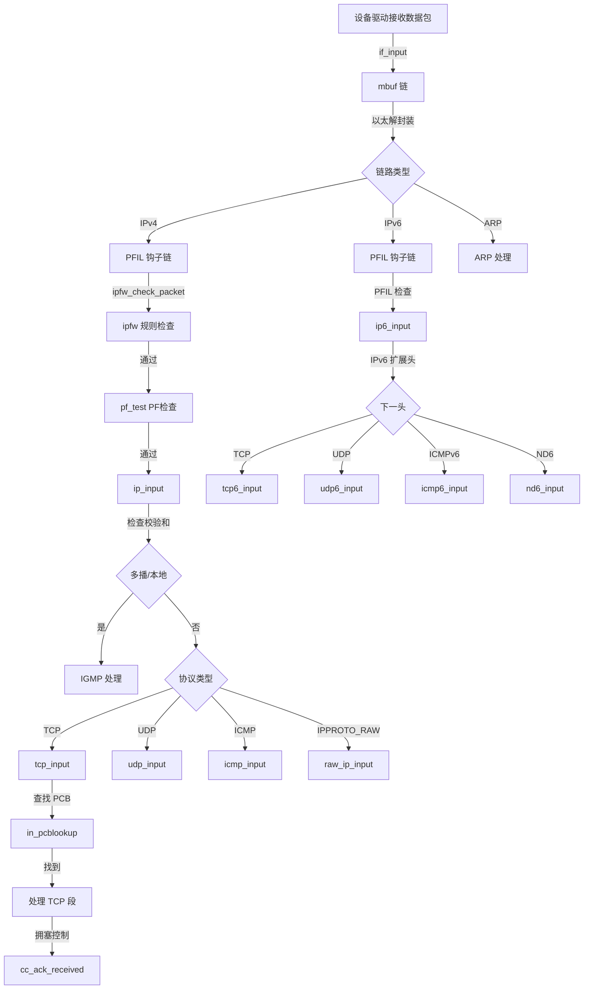
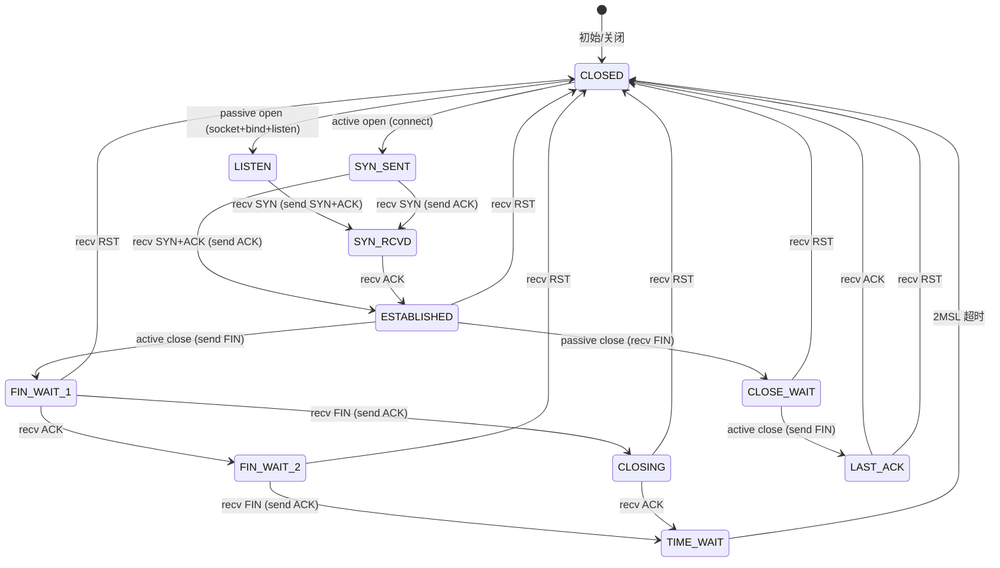
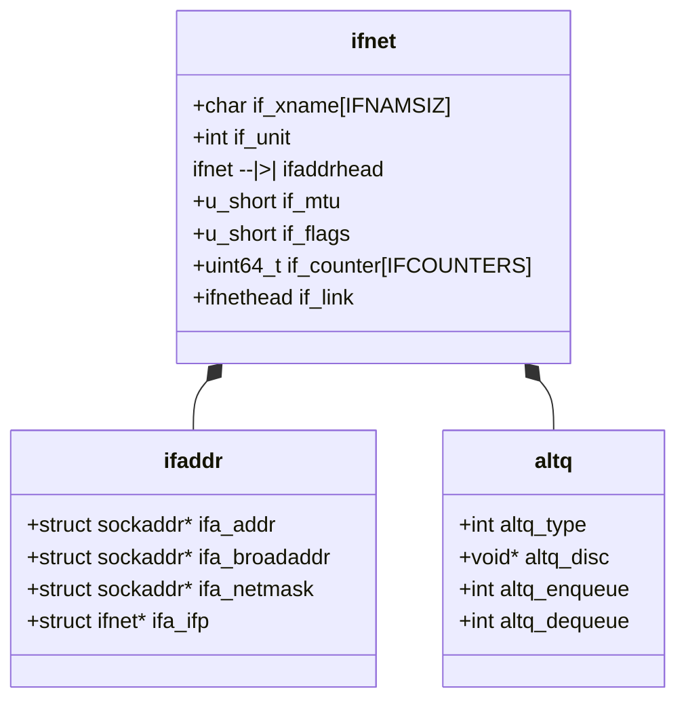
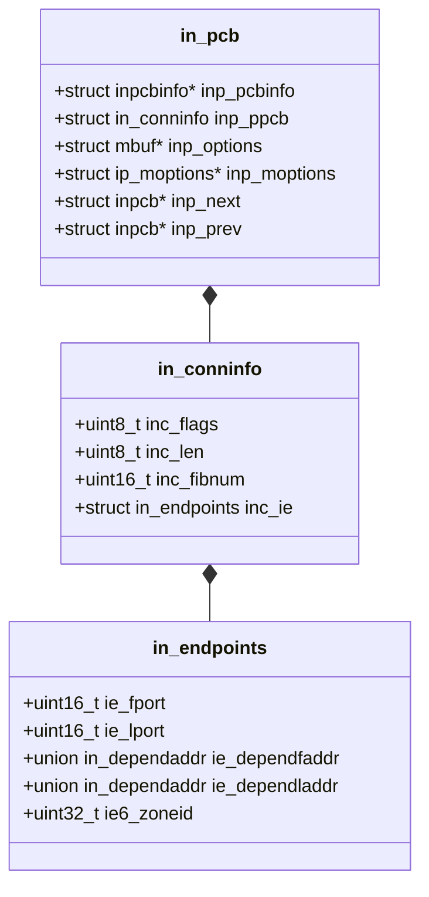
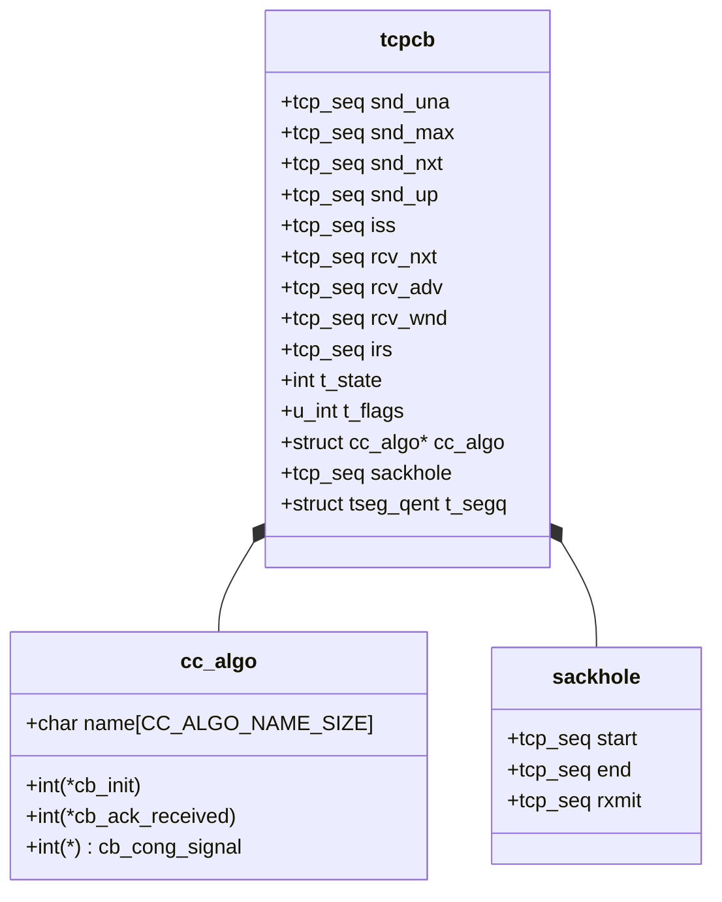
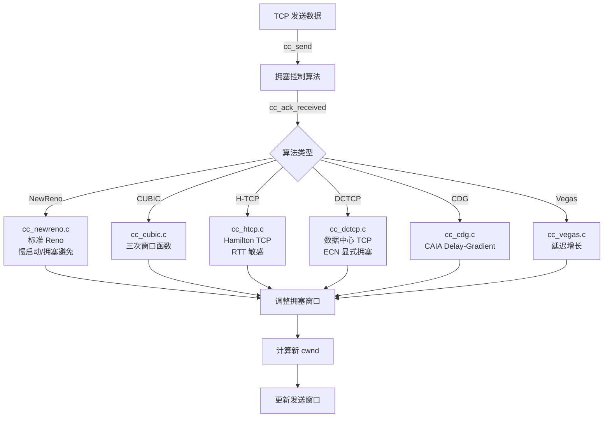
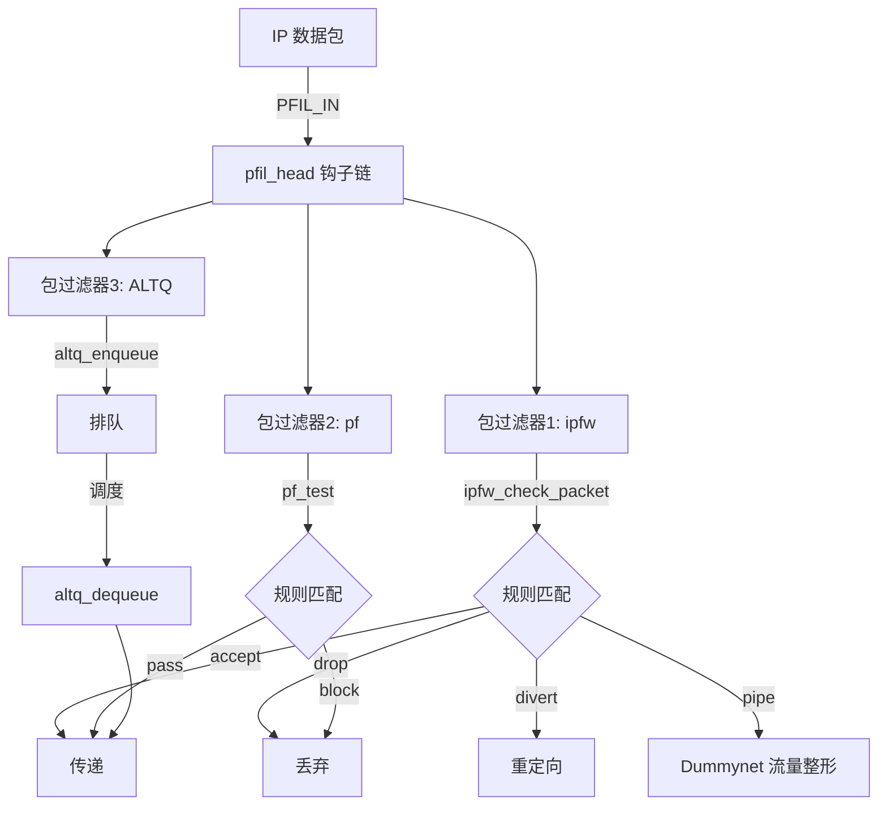
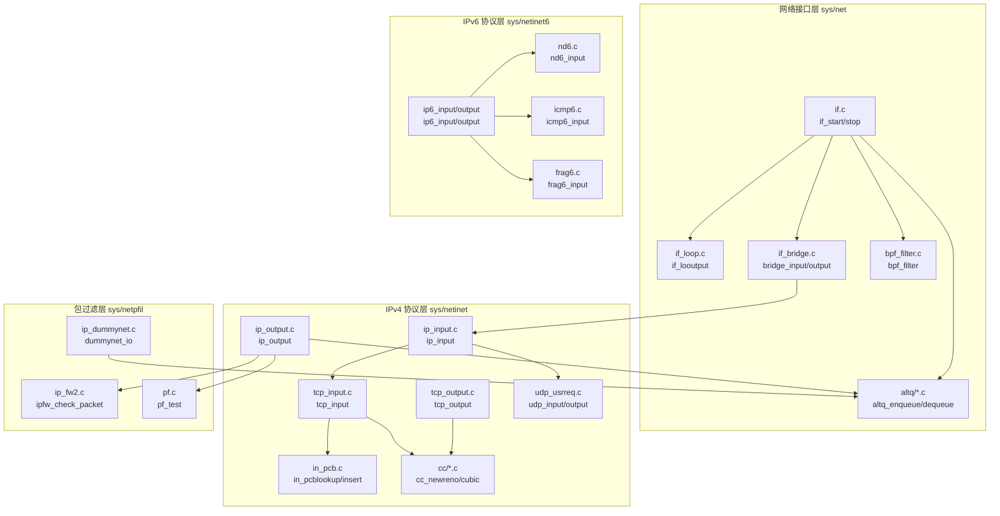

# FreeBSD 网络栈分析与架构图

## 一、模块概述

### 1. 核心模块

| 模块 | 目录 | 主要功能 |
|------|------|----------|
| **网络接口层** | sys/net/ | 网络设备抽象、接口管理、BPF、虚拟接口 |
| **IPv4 协议栈** | sys/netinet/ | IP 协议处理、TCP/UDP、ICMP、IGMP、拥塞控制 |
| **IPv6 协议栈** | sys/netinet6/ | IPv6 协议处理、IPv6 路由、邻居发现、多播 |
| **包过滤** | sys/netpfil/ | ipfw 防火墙、PF 防火墙、IPFilter、Dummynet 流量整形 |
| **NetBIOS/SMB** | sys/netsmb/ | SMB/CIFS 协议支持 |

### 2. 关键子模块

#### sys/net/ (网络基础设施)
- `if.c` - 接口核心管理、接口链表操作
- `if_loop.c` - 回环接口
- `if_bridge.c` - 网桥接
- `if_vlan.c` - VLAN 接口
- `if_gre.c` - GRE 隧道
- `if_tuntap.c` - TUN/TAP 虚拟设备
- `bpf_filter.c`, `bpf_buffer.c` - Berkeley 数据包过滤器
- `netisr.c` - 网络软件中断处理
- `altq/` - ALTQ 流量调度
  - `altq_cbq.c` - CBQ 调度位队列
  - `altq_fairq.c` - 公平队列
  - `altq_hfsc.c` - 分层公平服务曲线
  - `altq_codel.c` - CoDel 主动队列管理
- `route/` - 路由子系统
  - `route_ctl.c` - 路由控制
  - `fib_algo.c` - FIB 算法接口
  - `nhop.c` - 下一跳管理

#### sys/netinet/ (IPv4 协议)
- `ip_input.c` - IPv4 输入处理
- `ip_output.c` - IPv4 输出处理
- `ip_forward.c` - IP 转发
- `tcp_input.c` - TCP 输入处理
- `tcp_output.c` - TCP 输出处理
- `tcp_subr.c` - TCP 子程序
- `tcp_timer.c` - TCP 定时器管理
- `tcp_syncache.c` - SYN 缓存 (SYN 缓存)
- `udp_usrreq.c` - UDP 用户请求处理
- `in_pcb.c` - Internet PCB 管理
- `in_fib.c` - IPv4 FIB
- `cc/` - 拥塞控制算法
  - `cc_newreno.c` - NewReno (默认)
  - `cc_cubic.c` - CUBIC
  - `cc_htcp.c` - H-TCP
  - `cc_dctcp.c` - DCTCP
  - `cc_cdg.c`, `cc_chd.c`, `cc_vegas.c` - 其他算法

#### sys/netinet6/ (IPv6 协议)
- `ip6_input.c` - IPv6 输入处理
- `ip6_output.c` - IPv6 输出处理
- `ip6_forward.c` - IPv6 转发
- `nd6.c` - IPv6 邻居发现
- `nd6_nbr.c` - 邻居缓存
- `nd6_rtr.c` - 路由器发现
- `icmp6.c` - ICMPv6 处理
- `frag6.c` - IPv6 分片重组
- `in6_pcb.c` - IPv6 PCB 管理
- `in6_fib.c` - IPv6 FIB
- `mld6.c` - MLDv2 (多播监听发现)

#### sys/netpfil/ (包过滤)
- `ipfw/`
  - `ip_fw2.c` - ipfw 核心实现
  - `ip_fw_pfil.c` - ipfw 包过滤钩挂
  - `ip_dummynet.c` - Dummynet 流量模拟
- `pf/`
  - `pf.c` - PF 防火墙核心
  - `pf_ruleset.c` - 规则集管理
  - `pf_norm.c` - 数据包正规化
  - `pf_table.c` - 地址表管理
- `ipfilter/netinet/` - IPFilter (第三方)

---

## 二、架构图

### 整体网络栈架构

```mermaid
graph TD
    A[用户空间应用] -->|socket()| B[Socket 层]
    B -->|send/recv| C[协议控制块 PCB]
    C -->|in_pcb*| D[传输层]
    D -->|TCP/UDP/ICMP| E[网络层]
    E -->|IPv4/IPv6| F[包过滤层 PFIL]
    F -->|ipfw/pf/ipfilter| G[路由层]
    G -->|fib*| H[接口层 ifnet]
    H -->|if_output| I[设备驱动层]

    subgraph "sys/netinet (IPv4)"
        D1[TCP]
        D2[UDP]
        D3[ICMP]
        D4[IGMP]
        E1[ip_input/output]
        C1[in_pcb]
        D --> D1 & D2 & D3
        E --> E1
        C --> C1
    end

    subgraph "sys/netinet6 (IPv6)"
        E2[ip6_input/output]
        N1[ND6]
        N2[MLD6]
        E --> E2
    end

    subgraph "sys/netpfil"
        F1[ipfw]
        F2[pf]
        F --> F1 & F2
    end

    subgraph "sys/net"
        G1[route/*]
        H1[if.c]
        B1[BPF]
        ALTQ[ALTQ]
        H --> G1 & H1 & B1 & ALTQ
    end
```

### 协议栈层级结构

```mermaid
graph LR
    subgraph 应用层
        APP[应用程序]
    end

    subgraph 套插座层系统
        SOCK[Socket API]
        PR1[Protocol Switch<br/>ipprotosw[]]
        PCB[PCB 哈希表<br/>udpcb_hash<br/>tcbinfo]
    end

    subgraph 传输层 Transport Layer
        TCP[TCP 模块<br/>tcp_input.c<br/>tcp_output.c]
        UDP[UDP 模块<br/>udp_usrreq.c]
        CC[拥塞控制<br/>cc_newreno.c<br/>cc_cubic.c]
    end

    subgraph 网络层 Network Layer
        IP4[IPv4<br/>ip_input/output]
        IP6[IPv6<br/>ip6_input/output]
        ICMP[ICMP/ICMP6]
        MCAST[多播 IGMP/MLD6]
    end

    subgraph 包过滤 Packet Filtering
        PFIL[PFIL 钩子框架]
        IPFW[ipfw 防火墙]
        PF[PF 防火墙]
        ALTQ[ALTQ 流量整形]
    end

    subgraph 路由和接口 Routing & Interface
        RT[路由表 FIB<br/>in_fib.c]
        IF[网络接口<br/>ifnet 结构]
        BPF[BPF 数据包过滤器]
    end

    APP --> SOCK
    SOCK --> PR1
    PR1 --> PCB
    PCB --> TCP & UDP
    TCP --> CC
    TCP & UDP --> IP4 & IP6
    IP4 & IP6 --> PFIL
    PFIL --> IPFW & PF
    PFIL --> ALTQ
    IP4 & IP6 --> RT
    RT --> IF
    IF --> BPF
```

---

## 三、数据流图

### 入包处理流程



### 出包处理流程

```mermaid
graph TD
    A[用户 send() 调用] -->|so_send| B[Socket 层]
    B -->|协议处理| C{协议类型}

    C -->|TCP| D[tcp_output]
    C -->|UDP| E[udp_output]

    D -->|构建 TCP 头| F[拥塞控制 CC]
    F -->|窗口检查| G{可发送}
    G -->|是| H[分片处理]
    G -->|否| I[阻塞/缓存]

    H -->|构建 IP 头| J[ip_output]
    E -->|构建 UDP 头| J

    J -->|路由查找| K[rtalloc1]
    K -->|输出接口| L[if_output]
    L -->|PFIL 输出钩| M[ipfw/pf 检查]
    M -->|通过| N[ALTQ 队列]

    N -->|流量整形| O[排队/延迟]
    O -->|接口输出| P[设备驱动发送]
```

### TCP 连接建立流程

```mermaid
graph TD
    A[客户端主动连接] -->|socket()| B[创建 TCP PCB]
    B -->|connect()| C[进入 SYN_SENT 状态]
    C -->|tcp_output| D[发送 SYN 包]

    D -->|IP 层| E[ip_output 路由]

    E -->|SYN 到达服务器| F[tcp_input 处理]
    F -->|状态 LISTEN| G[创建新 PCB]
    G -->|检查 syncookie| H[SYN 缓存]
    H -->|接受| I[进入 SYN_RCVD]
    I -->|tcp_output| J[发送 SYN-ACK]

    J -->|客户端收到| K[tcp_input]
    K -->|状态 SYN_SENT| L[进入 ESTABLISHED]
    L -->|tcp_output| M[发送 ACK]

    M -->|服务器收到 ACK| N[tcp_input]
    N -->|状态 SYN_RCVD| O[进入 ESTABLISHED]

    O -->|连接建立完成| P[数据传输开始]
```

### TCP 状态机



---

## 四、关键结构体

### ifnet 结构 (sys/net/if_var.h)
网络接口的核心抽象，表示所有网络设备



### in_pcb 结构 (sys/netinet/in_pcb.h)
Internet 协议控制块，管理传输层连接



### tcpcb 结构 (sys/netinet/tcp_var.h)
TCP 协议控制块，管理 TCP 连接状态



---

## 五、拥塞控制模块



---

## 六、包过滤架构



---

## 七、模块调用关系



---

## 八、关键文件路径索引

### 网络接口层
- [if.c](sys/net/if.c) - 接口核心
- [if_var.h](sys/net/if_var.h) - 接口数据结构
- [if_loop.c](sys/net/if_loop.c) - 回环接口
- [if_bridge.c](sys/net/if_bridge.c) - 网桥
- [bpf_filter.c](sys/net/bpf_filter.c) - BPF 过滤器

### IPv4 协议
- [ip_input.c](sys/netinet/ip_input.c) - IPv4 输入
- [ip_output.c](sys/netinet/ip_output.c) - IPv4 输出
- [tcp_input.c](sys/netinet/tcp_input.c) - TCP 输入
- [tcp_output.c](sys/netinet/tcp_output.c) - TCP 输出
- [tcp_subr.c](sys/netinet/tcp_subr.c) - TCP 辅助函数
- [tcp_timer.c](sys/netinet/tcp_timer.c) - TCP 定时器

- [in_pcb.c](sys/netinet/in_pcb.c) - PCB 管理
- [in_pcb.h](sys/netinet/in_pcb.h) - PCB 结构
- [tcp_var.h](sys/netinet/tcp_var.h) - TCP 变量和结构
- [tcp_fsm.h](sys/netinet/tcp_fsm.h) - TCP 状态机

### 拥塞控制
- [cc/cc.c](sys/netinet/cc/cc.c) - CC 框架
- [cc/cc_newreno.c](sys/netinet/cc/cc_newreno.c) - NewReno
- [cc/cc_cubic.c](sys/netinet/cc/cc_cubic.c) - CUBIC
- [cc/cc_htcp.c](sys/netinet/cc/cc_htcp.c) - H-TCP
- [cc/cc_dctcp.c](sys/netinet/cc/cc_dctcp.c) - DCTCP

### IPv6 协议
- [ip6_input.c](sys/netinet6/ip6_input.c) - IPv6 输入
- [ip6_output.c](sys/netinet6/ip6_output.c) - IPv6 输出
- [nd6.c](sys/netinet6/nd6.c) - 邻居发现
- [icmp6.c](sys/netinet6/icmp6.c) - ICMPv6
- [frag6.c](sys/netinet6/frag6.c) - 分片重组

### 包过滤
- [ipfw/ip_fw2.c](sys/netpfil/ipfw/ip_fw2.c) - ipfw 核心
- [ipfw/ip_fw_pfil.c](sys/netpfil/ipfw/ip_fw_pfil.c) - ipfw 钩子
- [pf/pf.c](sys/netpfil/pf/pf.c) - PF 核心
- [pf/pf_ioctl.c](sys/netpfil/pf/pf_ioctl.c) - PF 控制
- [pfil.h](sys/net/pfil.h) - 包过滤接口

### 路由
- [route/route_ctl.c](sys/net/route/route_ctl.c) - 路由控制
- [route/fib_algo.c](sys/net/route/fib_algo.c) - FIB 算法
- [in_fib.c](sys/netinet/in_fib.c) - IPv4 FIB
- [in6_fib.c](sys/netinet6/in6_fib.c) - IPv6 FIB
