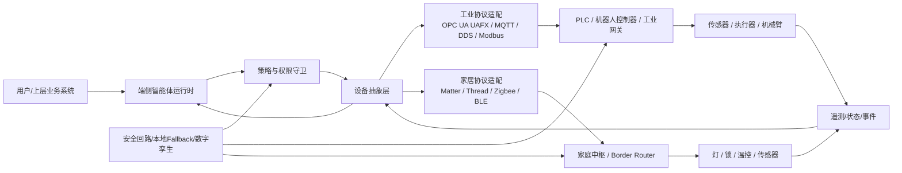
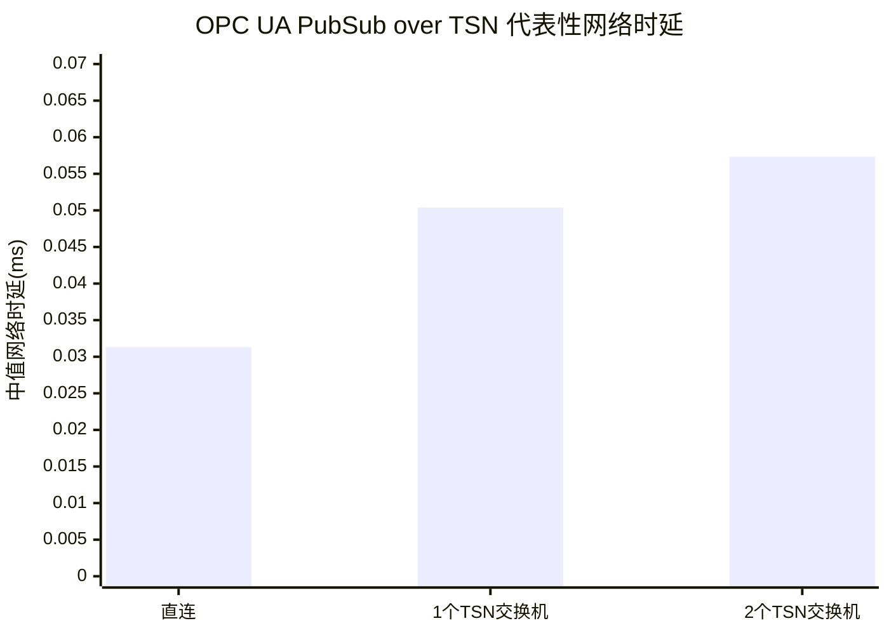

## 执行摘要

端侧智能体要真正“下接设备、闭环控制”，核心矛盾不是模型本身是否足够聪明，而是**语义层自主性**与**控制层确定性**之间的错位：工业控制和机器人往往要求毫秒级甚至更短的确定性时序，而 ReAct 一类“感知—推理—调用工具—再观察”的多步循环，会把感知、协议桥接、策略检查、模型推理、执行确认等时延串联起来，因此很难直接放进伺服、安全或硬实时闭环。近年的主流工程做法，是把智能体放在**边缘网关、工业 PC、机器人上位机或家庭中枢**，负责意图理解、任务编排、异常处理和策略优化；把**PLC、机器人控制器、安全回路、设备固件**继续保留为最终执行与安全保障层。工业侧由 OPC UA/UAFX、DDS/ROS 2、TSN、EtherCAT、MQTT 等构成“语义互操作 + 实时数据面”的组合；家居侧则由 Matter/Thread、本地 Hub、设备 Fabric 与本地自动化引擎承担控制闭环。

从工程决策看，近五年的共识大致可归纳为三点。其一，**接入层的瓶颈仍比模型层更顽固**：设备发现、证书与身份、协议适配、驱动“长尾”、固件版本漂移，决定了智能体是否能稳定触达设备。工业侧以 OPC UA GDS、EdgeX Device Service、KubeEdge DMI、Azure IoT Operations Connector 等集中治理；家居侧以 Matter 委配、BLE/Wi-Fi/DNS-SD 发现、Thread Border Router 与 Thread 1.4 凭据共享改善接入体验。其二，**时延预算必须分层**：像 EtherCAT 这类总线已能做到 12.5 μs 级周期；工业机器人控制环常见频率在 100 Hz–1 kHz；而 ROS 2 在默认栈上相对底层 DDS 仍可能带来最高约 50% 额外时延，说明“工具链便利性”与“极致实时性”往往不可兼得。其三，**可靠性与安全正在从“网络安全”扩展到“智能体动作安全”**：IEC 62443、IEC 61508、ISO 10218、OPC UA Safety、ETSI EN 303 645、NISTIR 8259 仍是底座，但“自然语言到物理动作”的权限、验证、可追溯和故障回退机制，仍缺统一标准。

因此，本报告的结论是：若目标是**工业自动化**，应采用“智能体在监督层、PLC/机器人控制器在执行层、安全 PLC/硬连线在保护层”的三层架构；若目标是**智能家居**，应优先采用 Matter 本地控制、Thread 1.4 兼容边界路由器与本地自动化引擎，把云端语音和大模型仅保留在非关键路径上。当前最值得投入的方向，不是让智能体直接接管快闭环，而是提升**南向抽象统一性、局部自治、可验证执行和跨协议调试可观测性**。

## 研究范围与典型架构

本文按两类典型场景讨论：一类是**工业自动化**，对象包括传感器、PLC、伺服、机械臂、AMR/AGV 与产线设备；另一类是**智能家居**，对象包括照明、门锁、温控、安防、传感器与家庭中枢。二者共同点是：端侧智能体并不直接操纵“裸设备寄存器”，而是通过一层**南向抽象与协议适配器**进入设备世界；差异在于工业更重视确定性、功能安全与版本治理，家居更重视低门槛接入、跨品牌互通与本地/离线体验。

该架构背后的行业做法很稳定：工业侧，OPC UA FX 试图把语义模型和连接模型一直延伸到现场级，覆盖控制器到控制器、控制器到设备、设备到计算等交互；ROS 2 则以 DDS 为底座，提供机器人应用开发与分布式通信；KubeEdge、OpenYurt、EdgeX Foundry、Azure IoT Operations、AWS IoT Greengrass 则承担边缘编排、设备接入与本地自治。家居侧，Matter 在应用层定义统一控制模型，以 Wi‑Fi/Thread 为承载网络，并用 BLE 等方式进行委配，从而把设备发现、接入和本地控制标准化。

## 关键维度分析

下表按用户要求的八个维度汇总挑战、可量化指标、现有做法与未解决问题。部分维度缺乏跨行业统一阈值，业界通常以 SLO、测试基线或认证要求代替统一标准。

| 维度 | 主要挑战 | 可量化指标或典型阈值 | 现有解决方案与典型实现 | 未解决问题 | 代表来源 |
|---|---|---|---|---|---|
| 接入便利性 | 设备发现跨子网困难；证书/身份分散；协议与驱动长尾；固件和模型版本错配 | 常用指标是首次上线成功率、上线耗时、协议/驱动覆盖率；Matter 标准化了 BLE、Wi‑Fi Soft AP、DNS‑SD 委配/发现路径；OPC UA GDS 支持跨子网发现与证书集中管理，但并无统一“秒级”阈值 | 工业侧用 OPC UA LDS/GDS、EdgeX Device Service SDK、KubeEdge DMI/Mapper、Azure OPC UA Connector；家居侧用 Matter 委配、Thread Border Router、Thread 1.4 凭据共享 | 驱动长尾仍重；多品牌 Thread 网络融合仍在推进；“零手工接入”尚不普遍 |  |
| 操作易用性 | 原始寄存器/Topic 难以表达业务语义；编排与回滚路径复杂；跨协议调试不可见 | 常用指标是接口抽象颗粒度、流程搭建时间、问题定位时间；缺少跨平台统一阈值 | OPC UA 信息模型/UAFX、EdgeX Device Profile、Greengrass Shadow、KubeEdge DeviceTwin；机器人侧常用行为树与任务树；调试侧用 Foxglove / ROS 工具链；家居侧用 Home Assistant UI | 语义层“动作能力模型”缺统一规范；智能体执行轨迹的复现实验与可解释调试仍弱 |  |
| 实时性与时延 | ReAct 多步循环把感知、推理、工具调用、执行确认串联；协议桥接与中间件引入额外抖动 | 工业机器人闭环常见 100 Hz–1 kHz；EtherCAT 已展示 12.5 μs 周期；ROS 2 默认栈相对底层 DDS 最高约 50% 额外时延；OPC UA PubSub+TSN 实测端到端约 0.80–1.46 ms，直连/一跳/两跳 TSN 的中值网络时延约 31.31/50.37/57.34 μs；EMQX 低载测试中 broker latency 为 0.048–0.07 ms、response time 约 1.7 ms | 主流做法是把 Agent 放在监督层，只下发技能、配方、任务，不进入伺服/安全内环；本地缓存、预编译动作、微技能库、事件驱动总线用于缩短闭环 | 缺少“Agent→Tool→Device”统一基准；ReAct 多轮交互的时延预算与抖动上界尚未标准化 |  |
| 可靠性与安全 | 网络分区、边缘离线、工具失败、误动作、攻击面扩张 | 常用指标是 MTTR、重连成功率、离线连续运行时间；工业安全常以 IEC 62443 安全等级、IEC 61508/IEC 61784‑3、ISO 10218 和 OPC UA Safety 为框架；消费 IoT 常以 ETSI EN 303 645、NISTIR 8259 为基线 | Greengrass 本地 Shadow 与离线认证；KubeEdge/OpenYurt 边缘自治；OPC UA GDS 集中证书；Matter 本地控制与 Fabric 机制；工业侧用 OPC UA Safety 将安全通信与业务通信分层 | “自然语言→物理动作”的授权、审计和意图验证仍未成体系；针对 Edge Agent 的机密执行与形式化安全壳仍在研究 |  |
| 资源受限设备的计算与能耗 | 终端 MCU/SoC 存储、功耗和散热受限；LLM/多模态模型难以下沉 | MLPerf Tiny 针对的嵌入式设备典型在 10–250 MHz、功耗低于 50 mW；TinyML 推理常见 0.18–300 ms；Llama‑7B FP16 推理约需 14 GB 内存；CLONE 论文显示边缘 LLM 定制可获得最高 11.92× 加速和 7.36× 节能；CMSIS‑NN 曾报告 4.6× 运行速度和 4.9× 能效提升 | 典型做法是“MCU 做采集/规则、边缘网关做推理/编排、云做训练/复杂规划”；结合量化、裁剪、NPU、TinyML、模型分层与事件触发唤醒 | 永久在线 Agent 的功耗调度、共载干扰、断电恢复与模型热更新仍难；家居电池设备更不适合承载复杂 agent runtime |  |
| 可扩展性与互操作性 | 多供应商协议和语义模型难统一；大规模发现与版本兼容复杂 | 常见指标是节点规模、跨厂商互通成功率、升级兼容率；ROS 2 社区针对大网络/Wi‑Fi 推荐 Discovery Server；Thread 1.4 以凭据共享缓解多网络碎片化 | OPC UA/UAFX 做工业语义与连接抽象；Matter 做家居应用层互通；ROS 2 + Fast DDS Discovery Server 解决大规模发现；VDA5050 + MQTT 适合 AMR 车队调度 | 语义互操作仍多停留在“能连通”，离“动作语义完全等价”尚远；版本漂移是长期问题 |  |
| 部署与运维成本 | 设备侧 OTA、证书轮换、日志收集、Kubernetes/容器栈维护复杂 | 常见指标是单运维人管理节点数、升级成功率、回滚时间；缺少统一行业阈值 | EdgeX 适合轻量边缘；KubeEdge/OpenYurt/Azure IoT Operations 强于大规模运维与云边协同；Home Assistant 适合单点或小规模家庭场景；GDS/Shadow/设备孪生可降低人工接触成本 | 设备状态、应用状态与模型状态的统一 GitOps 仍不成熟；Kubernetes 型方案学习曲线高 |  |
| 法规、合规与行业标准 | 安全、网络安全、隐私与 AI 责任边界交叉 | 工业侧围绕 IEC 62443、IEC 61508、ISO 10218、OPC UA Safety/UAFX；消费侧围绕 ETSI EN 303 645、NISTIR 8259、Matter 认证 | 工业场景强调功能安全与网络分区；家居场景强调默认安全、弱口令禁止、更新与数据保护 | 面向“可自主执行”的 AI Agent 尚缺成熟合规模板，特别是动作解释、责任归因与验证证据链 |  |

## 延迟与闭环性能

ReAct 模式的闭环时延，工程上可近似拆为：**感知采集 + 预处理 + 模型推理 + 工具调用/协议转换 + 设备执行 + 观察确认**。由于 ReAct 把“Reasoning”和“Acting”交替展开，若一轮任务需要多次 Action/Observation，闭环总时延几乎按轮次线性增长；因此在物理世界中，“多步智能”通常以更好的解释性和灵活性，换取更高的平均时延和更差的抖动上界。这也是工业界倾向把 Agent 放在任务层，而不是直接放进运动控制或安全联锁层的根本原因。该判断是基于 ReAct 的交互式闭环结构，以及工业总线、ROS 2、OPC UA/TSN 等公开时延结果作出的工程推断。

公开资料中的代表性结果说明了这种分层是必要的。ROS 2 多节点系统论文显示，在默认设置下，端到端时延强烈依赖 DDS 中间件，并可能比底层 DDS 通信高出约 50%；而 OPC UA PubSub over TSN 的实验则给出了更接近工业数据面的结果：在所测平台上，端到端时延约为 0.80–1.46 ms，新增 TSN 交换机后网络中值时延从 31.31 μs 增加到 50.37 μs 与 57.34 μs。另一方面，MQTT broker 在低负载下可以达到很低的 broker latency，但这并不自动意味着“适合快闭环控制”，因为桥接、网关、PLC 扫描周期和应用调度往往比 broker 本身更慢。

上图基于同一实验中的中值网络时延换算，反映了**拓扑复杂度会吞噬时延预算**。

对两类场景，可给出较稳妥的工程阈值。工业自动化中，凡是落入 **1–10 ms** 或更严苛预算的闭环，尤其运动控制、同步 I/O、安全停机与机械臂插补，应由 PLC、机器人控制器、现场总线或专用实时软件负责；Agent 更适合 **100 ms–秒级** 的监督控制，如工艺切换、异常诊断、任务派发、人机协同、配方调整与多设备协调。智能家居中，界面或按键交互通常可参考 HCI 的 **0.1 s“近乎瞬时”**与 **1 s“保持流畅感”** 两个经验界限，因此在家庭场景中，本地 Matter/Thread 控制明显优于“云端语音识别 + 云端自动化 + 云回写设备”的路径，而云端大模型更适合问答、复杂规则生成和跨系统编排。

## 平台与协议对比

下表聚焦常见平台、协议与实现，便于工程选型。表中“优点/缺点”是基于官方架构与公开案例做的工程归纳。

| 平台/协议/实现 | 更适合的场景 | 优点 | 主要短板 | 代表来源 |
|---|---|---|---|---|
| OPC UA FX + GDS + Safety | 工业自动化、跨厂商设备互联 | 统一信息模型、证书集中治理、向现场级延伸、可叠加功能安全 | 生态仍在演进；现场级细分 profile 与设备普及度不均；实施复杂 |  |
| ROS 2 + DDS + Fast DDS Discovery Server / Vulcanexus | 机器人、机械臂、移动机器人 | 开发生态成熟；QoS 丰富；适合复杂感知与模块化系统 | 默认栈不等于极致实时；发现与部署在大网络/Wi‑Fi 中需额外调优 |  |
| EdgeX Foundry | 工业边缘网关、异构协议接入 | 设备服务模式清晰；协议扩展友好；对南向“长尾驱动”友好 | 编排与治理能力不如完整云原生平台；需自行整合更多运维能力 |  |
| KubeEdge / OpenYurt | 大规模边缘节点与云边协同 | Kubernetes 兼容；设备管理与边缘自治能力强；适合分布式运维 | 集群复杂度高；对团队云原生能力要求较高 |  |
| AWS IoT Greengrass | 设备影子、本地规则、离线运行 | 本地 Shadow、离线认证与组件机制成熟 | 与 AWS 生态耦合较深；工业语义层建模能力相对弱 |  |
| Azure IoT Operations / OPC Publisher | 工业 MQTT/OPC UA 数据面、本地 Kubernetes | 面向边缘统一数据平面；OPC UA 连接器支持浏览、监测、写入 | 依赖 Arc/Kubernetes，运维门槛较高；版本已知问题需跟踪 |  |
| Matter + Thread + Home Assistant / Google Home 本地控制 | 智能家居 | 标准化接入体验；本地控制提升可靠性、隐私和时延；多生态兼容性强于传统私有协议 | Thread 多 Border Router 融合和凭据共享曾长期不顺；生态落地存在节奏差异 |  |
| NVIDIA Isaac Mission Dispatch + VDA5050 over MQTT | AMR/AGV 车队任务层调度 | 任务树与行业协议结合，适合车队级编排 | 更偏任务/调度层，不适合替代底层运动控制 |  |

如果从协议角度压缩为工程判断，可以概括为：**OPC UA/UAFX 负责工业语义互操作，DDS/ROS 2 负责机器人模块化通信，TSN/EtherCAT 负责强实时数据面，MQTT 负责事件与遥测，Matter/Thread 负责家居场景的本地互通与委配**。把这些协议“混搭”起来，而不是期望某一种协议包打天下，已经成为过去五年的主流做法。

## 工程建议与结论

对**工业自动化**，最稳妥的架构是“双环 + 安全壳”：最快的控制内环留给现场总线、PLC 与机器人控制器；Agent 只在边缘节点上运行，以技能、任务树、配方或参数集的形式下发控制意图，并通过 OPC UA GDS、设备孪生、日志与审计维持治理。若涉及功能安全，必须继续依赖 IEC 61508、ISO 10218、OPC UA Safety 等链路，不应让大模型直接承担最终安全裁决。这一点不是“保守”，而是由当前 Agent 系统的非确定性与安全认证体系之间的结构性落差决定的。

对**智能家居**，优先级则不同：第一优先是尽量让控制路径本地化，第二优先是简化接入，第三优先才是引入复杂 Agent。换言之，先把 Matter + Thread + 本地 Hub 跑顺，再讨论语音 Agent、规则生成或家庭助手。遇到多品牌 Thread 网络时，应优先选择支持 Thread 1.4 凭据共享与较好诊断能力的中枢/边界路由器；在家庭场景中，用户体感更接近 HCI 的 0.1–1 s 阈值，因此“是否本地执行”往往比“模型是否更强”更能决定体验。

总体上，未来两三年最值得关注的研究方向有四个。第一，是**南向动作语义的标准化**，即让“开阀门”“回零”“安全停机”“开始巡检”这类动作在不同协议和平台中具备一致、可验证的语义。第二，是**Agent 闭环基准测试**，不仅测模型本身，而要测从感知到执行确认的全链路时延、抖动、失败率与恢复时间。第三，是**可验证执行与机密边缘运行时**，用策略壳、TEE、可回放日志和形式化约束降低“文本到物理动作”的风险。第四，是**模型与设备协同调度**，让 TinyML、SLM、边缘 LLM 与规则引擎在一套能耗预算里协同，而不是相互抢资源。

## 关键参考来源

以下列出本报告最关键、且尽量偏原始资料与官方文档的来源；方括号标注来源语言。

《2025 工业智能体应用现状与趋势展望报告》西门子，工业智能体定义、构成与工业场景要求。[中] 

KubeEdge 中文文档《设备管理框架》与《为什么选择 KubeEdge》，说明 DMI、设备孪生和云边协同设计。[中] 

西门子中文文档《使用 OPC UA GDS 推送进行动态证书管理》与《OPC UA - 开放式平台通信》，说明 discovery、证书和安全概念。[中] 

OPC Foundation 官方 UAFX/FLC、Part 15 Safety、Part 80/81/82 文档，说明 OPC UA 向现场级、功能安全与连接模型延伸。[英] 

Yao 等，《ReAct: Synergizing Reasoning and Acting in Language Models》，说明 ReAct 闭环的交替推理—行动结构。[英] 

Kronauer 等，《Latency Analysis of ROS2 Multi-Node Systems》，给出 ROS 2 相对底层 DDS 的时延开销与多节点测量。[英] 

Denzler 等，《Timing Analysis of TSN-Enabled OPC UA PubSub》，给出 OPC UA PubSub over TSN 的端到端与网络时延数据。[英] 

Connectivity Standards Alliance、Google Matter Primer、Thread Group White Paper，说明 Matter 委配、发现和 Thread 1.4 凭据共享。[英] 

Home Assistant、Google Home 本地 Matter 控制资料，说明家居本地控制对时延与可靠性的意义。[英] 

AWS IoT Greengrass、Azure IoT Operations、EdgeX Foundry 官方文档，说明影子、离线、本地数据平面与设备服务设计。[英] 

MLCommons MLPerf Tiny、TinyML Survey、CMSIS‑NN、CLONE 论文，说明资源受限设备上的时延、功耗与边缘 LLM 优化。[英] 

ISA/IEC 62443、ETSI EN 303 645、NISTIR 8259、ISO 10218 官方资料，说明工业与消费设备的安全/合规基线。[英]
