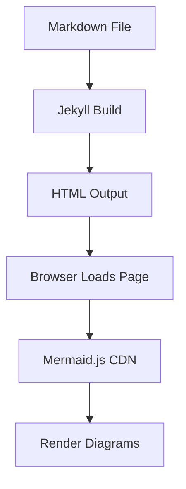
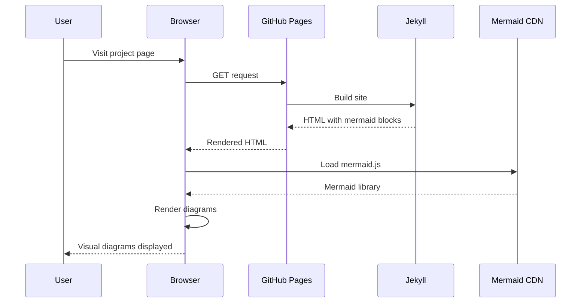
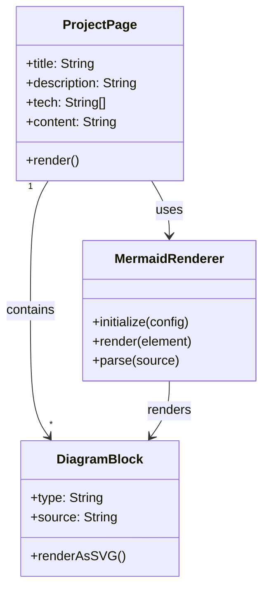
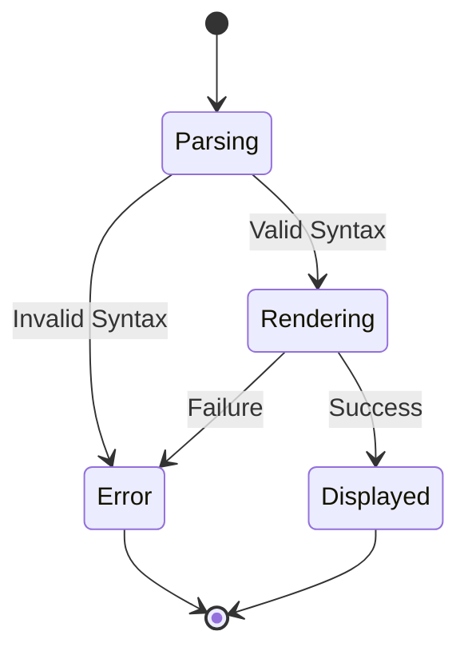
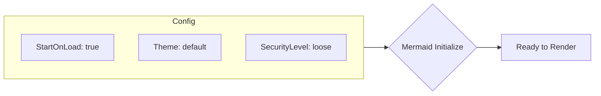

This project demonstrates the integration of Mermaid.js for rendering beautiful diagrams in project detail pages. The diagrams below are defined using Mermaid syntax and automatically rendered when the page loads.

## System Architecture

Here's a high-level architecture diagram showing how Mermaid.js integrates with Jekyll:



## Request Flow

This sequence diagram shows how a user request flows through the system:



## Component Structure

The class diagram below shows the key components in this integration:



## Processing States




## Benefits

Using Mermaid.js for diagrams offers several advantages:

1. **Text-based**: Write diagrams as code, version control friendly
2. **Automatic rendering**: No manual image creation needed
3. **Consistent styling**: Uniform appearance across all diagrams
4. **Easy updates**: Modify the code to update the diagram
5. **Multiple types**: Support for flowcharts, sequence diagrams, and more

## Supported Diagram Types

```mermaid
mindmap
  root((Mermaid Diagrams))
    Flowchart
      TD
      LR
    Sequence
      Participants
      Messages
    Class
      Relationships
      Methods
    State
      Transitions
      Actions
    Mindmap
      Hierarchical
      Radial
    Gantt
      Tasks
      Timeline
```

## Implementation Details

The Mermaid.js integration required minimal code changes:

1. **CDN Inclusion**: Added Mermaid.js script to the layout template
2. **Initialization**: Configured Mermaid with appropriate settings
3. **Styling**: Added CSS for proper diagram rendering
4. **Content**: Created example content with mermaid code blocks

### Configuration



## Future Enhancements

Potential improvements for this integration:

- Add theme selection options
- Support for custom diagram themes
- Export diagrams as SVG or PNG
- Interactive diagram elements
- Dark mode support for diagrams

## Conclusion

This demo shows how easy it is to integrate Mermaid.js into your Jekyll site for creating beautiful, maintainable diagrams. The text-based approach makes it perfect for technical documentation and project pages.
